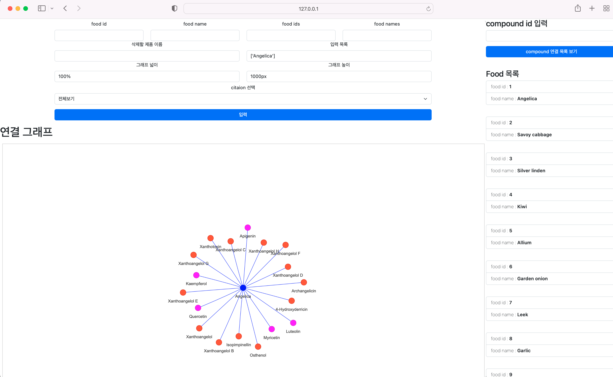
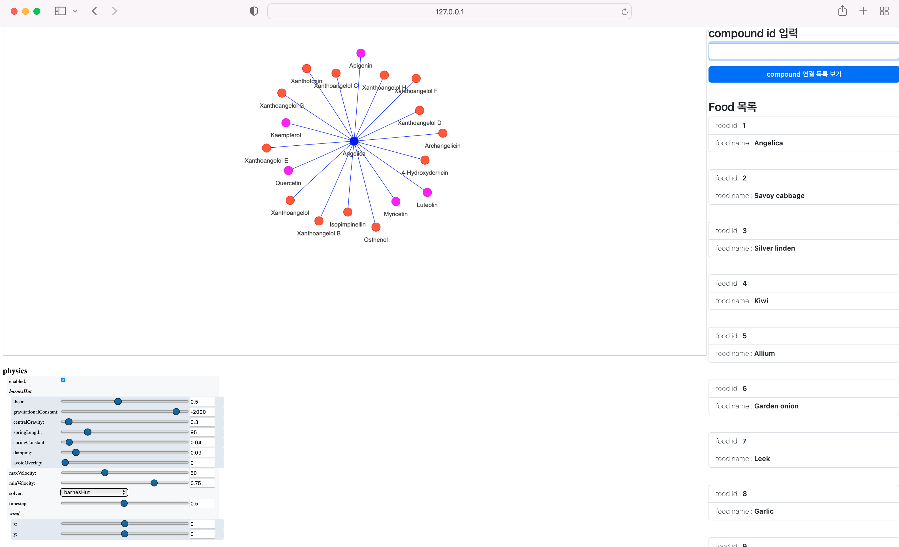
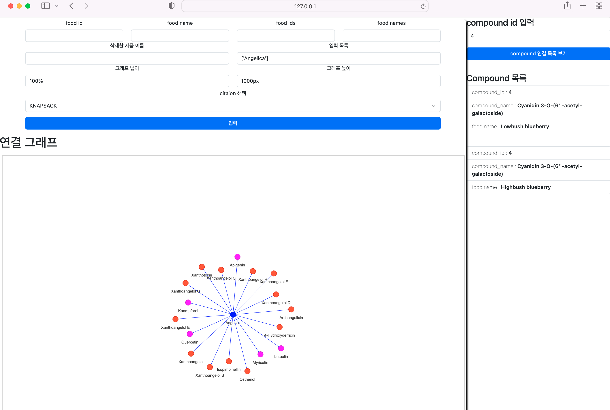

# Delight_food_web_v1

Delight_food_web_v1은 FooDB 데이터를 기반으로 네트워크 그래프를 그리고 확인할 수 있는 웹 페이지 서비스입니다.

복잡계 네트워크로 Food와 Compound를 표현해서 인사이트를 얻고 추후 GNN(Graph Neural Network)를 사용할 수 있습니다.

[간단 설치방법](#간단설치)

## 환경설정
### Git
- [git 설치 방법](https://git-scm.com/book/ko/v2/시작하기-Git-설치)


위의 가이드 대로 git을 설치한 뒤 다운로드를 원하는 경로에서 CLI를 열고 아래의 명령어를 입력해 주세요.

```git clone https://github.com/CoreDotToday/Delight_food_web_v1.git```

### Python
- [파이썬 설치](https://wikidocs.net/8)

기본적으로 Python이 설치되어 있어야합니다. 권장 버전은 Python 3.9.7입니다.

### MongoDB
FooDB의 데이터를 사용하기 위해서 NoSQL 데이터베이스인 MongoDB가 필요합니다.
- [MongoDB 설치방법](https://velopert.com/436)

MongoDB 설치 후 FooDB 데이터를 저장해야합니다.

압축을 해제 하면 아래의 디렉토리가 생성됩니다.

```
dump
└── drama
    ├── Compound.bson
    ├── Compound.metadata.json
    ├── Compound_and_Food.bson
    ├── Compound_and_Food.metadata.json
    ├── Content_conpund.bson
    ├── Content_conpund.metadata.json
    ├── Food.bson
    ├── Food.metadata.json
    ├── Food_and_Compound_2.bson
    └── Food_and_Compound_2.metadata.json
```

해당 디렉토리를 사용해서 데이터베이스에 저장(백업)하면 됩니다.

- [MongoDB 데이터 백업](https://www.mongodb.com/docs/database-tools/mongorestore/)
    - 데이터 백업을 위해서는 MongoDB Database Tools package가 필요합니다.
    - [MongoDB Database Tools package 설치 가이드](https://www.mongodb.com/docs/database-tools/installation/installation/)에서 OS를 선택하여 다운로드 해주세요.
    - 설치 후 CLI에서 아래의 명령어 형식에 맞춰 입력해주세요.
    ```
    mongorestore --uri mongodb://localhost:27017/dbName(몽고디비uri) --db YOUR_DB_NAME(몽고디비에서의 디비네임) YOUR_TARGET_FOLDER/YOUR_DB_NAME(덤프파일경로)
    ```
    아래의 예시처럼 작성할 수 있습니다.
    ```
    mongorestore --uri mongodb://localhost:27017/testdb --db testdb ../path/dump/testdb
    ```

## 웹페이지 실행

1. `./Delight_food_web_v1` 아래에 `.env` 파일을 생성한 뒤 아래의 코드를 입력하고 저장해주세요.
```
MONGO_URI=mongodb접속주소
DB_NAME=데이터베이스명
```
- [MongoDB 접속주소(uri) 형식](https://www.mongodb.com/docs/manual/reference/connection-string/#mongodb-uri)

2. CLI를 실행 시키고`./Delight_food_web_v1`로 이동해주세요.

3. 아래의 명령어를 실행해 주세요.
```
python3 -m pip install -r requirements.txt
```

```
python hello.py
```

4. output의 주소로 접속해주세요.

# FooDB 그래프 생성 웹



## 용어
1. food id : foodb 데이터의 food id
2. food name : foodb 데이터의 food name
3. citation : foodb 데이터의 출처 

## 그래프 생성 방법
- food id 입력란에 숫자 입력(int)
- food name 입력란에 정확한 food 이름 문자 입력(str)
    - ex) Angelica or 'Angelica'
- food ids 입력란에 여러 숫자 입력
    - ex) 1,2,3 or [1,2,3] or '1','2'
- food names 입력란에 여러 음식명 입력
    - ex) ['Angelica', 'Savoy cabbage']
- citation 선택 후 입력 버튼 클릭 시 해당 citation에 해당하는 compound를 그래프로 생성

## 그래프 삭제 방법
- 삭제할 food name 입력란에 삭제할 food node의 name 입력
    - ex) 'Angelica'

### 네트워크 그래프 조작



네트워크 아래의 physics 조작

1. enabled : 체크를 해제하면 알고리즘 계산으로 움직이는 노드의 움직임을 멈춘다.
2. barnesHut : BarnesHut is a quadtree based gravity model. It is the fastest. default and recommended solver for non-hierarchical layouts.

Parameters:	
- gravity (int) – The more negative the gravity value is, the stronger the repulsion is.
- central_gravity (float) – The gravity attractor to pull the entire network to the center.
- spring_length (int) – The rest length of the edges
- spring_strength (float) – The strong the edges springs are
- damping (float) – A value ranging from 0 to 1 of how much of the velocity from the previous physics simulation iteration carries over to the next iteration.
- overlap (float) – When larger than 0, the size of the node is taken into account. The distance will be calculated from the radius of the encompassing circle of the node for both the gravity model. Value 1 is maximum overlap avoidance.
3. solver : 네트워크 시각화 알고리즘 선택

## compound에 연결된 food 목록 보는법



- 오른쪽 공간의 compound id 입력란에 foodb의 compound id 입력
    - ex) 4

# 간단설치
- Delight_food_web_v1-master.zip파일의 압축을 해제하고
Delight_food_web_v1-master폴더에서 명령프롬프트, terminal 등의 CLI(command line interface)를 실행 시킨 후 아래의 명령어들을 순서대로 따라해주세요.

- Delight_food_web_v1-master 폴더안에서 dump.zip파일의 압축을 해제해주세요

CLI에서 아래와 같이 입력 했을 때
```
pwd
```
"../../Delight_food_web_v1-master/"
결과가 보이면 됩니다.

## python 설치
- python3 설치
```
sudo apt install python3
```
- 가상환경 설정
```
sudo apt install python3-venv
```
```
python3 -m venv delight_food_web_v1
```
- 가상환경 접속
```
source delight_food_web_v1/bin/activate
```
## mongodb 설치
- 우분투 버전 확인
```
lsb_release -dc
```
1 . 위 명령어의 실행결과가 [Ubuntu 20.04.2](#ubuntu-20) 인 경우

2. 위 명령어의 실행결과가 [Ubuntu 22.04.2](#ubuntu-22) 인 경우

### Ubuntu 20
```
wget -qO - https://www.mongodb.org/static/pgp/server-4.4.asc | sudo apt-key add -
```

```
echo "deb [ arch=amd64,arm64 ] https://repo.mongodb.org/apt/ubuntu focal/mongodb-org/4.4 multiverse" | sudo tee /etc/apt/sources.list.d/mongodb-org-4.4.list
```

```
sudo apt-get update
```
```
sudo apt-get install -y mongodb-org
```
```
sudo systemctl start mongod
```


### Ubuntu 22
```
wget -qO - https://www.mongodb.org/static/pgp/server-6.0.asc | gpg --dearmor | sudo tee /usr/share/keyrings/mongodb.gpg > /dev/null
```
```
echo  "deb [ arch=amd64,arm64 signed-by=/usr/share/keyrings/mongodb.gpg ] https://repo.mongodb.org/apt/ubuntu jammy/mongodb-org/6.0 multiverse" | sudo tee /etc/apt/sources.list.d/mongodb-org-6.0.list
```
```
sudo apt update
```
```
sudo apt install mongodb-org
```
```
sudo systemctl start mongod
```
### mongotoolkit 설치
```
wget https://fastdl.mongodb.org/tools/db/mongodb-database-tools-ubuntu2204-arm64-100.6.1.deb
```

### mongodb 데이터 백업
```
sudo apt-get install unzip # 압축 해제 명령어 install
```
```
unzip ./dump.zip # cli로 zip 파일 압축해제
```
```
mongorestore ./dump # dump폴더에 있는 데이터 백업
```
### 환경변수 설정
```
vi .env
```
1. 키보드의 a를 입력한 후  아래 코드 입력
```
MONGO_URI=mongodb://localhost 
DB_NAME=drama
```
2. ESC 누른 후 키보드의 ":" 키와 "wq" 입력 후 엔터

### 웹 서버 실행
```
python hello.py
```
